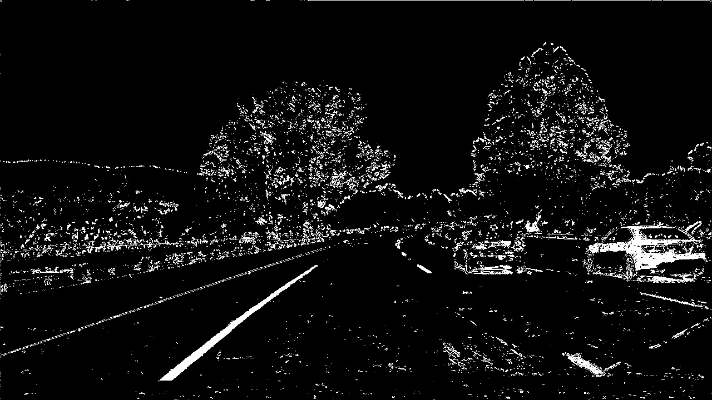

## Advanced Lane Finding
[](http://www.udacity.com/drive)

[image1]: ./output_images/video.png "header image"
[image4]: ./output_images/Thresholding/color_HLS.png "color_HLS image"
[image5]: ./output_images/Curve/curve_.png "curve_ image"

![alt text][image1]

## Overview
This project focuses on developing a robust lane finding pipeline, further refining the lane finding pipeline from the preivous project. Since the basic lane finding had its limit when encountered with road curvatures, polynomial line plot is introduced to replace linear line plot.In additon, further image processing is included to filter the image to get the better lane finding result, and it starts from camera calibration. The techniques used in this project include: 

* Camera Calibration
* Advanced image processing 
* Perspective Transform
* Histogram based lane finding
* Polynomial extraction
* Lane curvature and offset finding
* Overlay lane line

Camera Calibration
---
The first step into image processing includes camera calibration. openCV has a conveninent calibration tool for chessboard input images. Some example chessboard images taken from the camera in different angles are used as an input to compute distortion matrix and instrinsic camera matrix. Below is the example input and undistorted image output:

    

Next step is to generate 3d poins in real world space and obtain 2d points in image plane. 3d points are generated as a 3d matrix under predefined number of rows and columns as dimensions with three channels, where as 2d points in image plane are picked up based on OpenCV's chessboard corner points from input calibration images.The collection of 2d and 3d points from each input image is put in to cv2.calibrateCamera, thereafter intrinsic camera matrix and undistortion matrix are computed. 

```python
def cameraCalibration():
    # prepare object points, like (0,0,0), (1,0,0), (2,0,0) ....,(6,5,0)
    objp = np.zeros((6*9,3), np.float32)
    objp[:,:2] = np.mgrid[0:9,0:6].T.reshape(-1,2)
    
    # Arrays to store object points and image points from all the images.
    objpoints = [] # 3d points in real world space
    imgpoints = [] # 2d points in image plane.

    # Make a list of calibration images
    images = glob.glob('camera_cal/calibration*.jpg')

    # Step through the list and search for chessboard corners
    for fname in images:
        img = cv2.imread(fname)
        gray = cv2.cvtColor(img,cv2.COLOR_BGR2GRAY)
    
        # Find the chessboard corners
        ret, corners = cv2.findChessboardCorners(gray, (9,6),None)        
        # If found, add object points, image points
        if ret == True:
            objpoints.append(objp)
            imgpoints.append(corners)
            
            # Draw and display the corners
            img = cv2.drawChessboardCorners(img, (9,6), corners, ret)
    cv2.destroyAllWindows() 
    ret, mtx, dist, rvecs, tvecs = cv2.calibrateCamera(objpoints, imgpoints, gray.shape[::-1], None, None)
    return mtx, dist
```

```python
def unDistort(mtx,dist,img):
    dst = cv2.undistort(img, mtx, dist, None, mtx)
    return dst
```

Advanced image processing
---
This module discusses different methods to improve edge detection results by applying thresholding other than canny edge detection technique. Each thresholding method is introduced and explained in detail below:

1.Sobel thresholding

Sobel thresholding computes an approximation of the gradient of an image intensity function. A great advantge of using Sobel edge detection is the option to choose which gradient oreintation can be used for thresholding. For lane edge finding purposes, x orientation can be more advantageous than y direction. Below is the original image, gradient thresholding along x and along y:

    

```python
# Define a function that takes an image, gradient orientation,
# and threshold min / max values.
def abs_sobel_thresh(img, orient='x', sobel_kernel=3, abs_thresh = (0, 255)):
    # Convert to grayscale
    gray = cv2.cvtColor(img, cv2.COLOR_RGB2GRAY)
    # Apply x or y gradient with the OpenCV Sobel() function
    # and take the absolute value
    if orient == 'x':
        abs_sobel = np.absolute(cv2.Sobel(gray, cv2.CV_64F, 1, 0,ksize=sobel_kernel))
    if orient == 'y':
        abs_sobel = np.absolute(cv2.Sobel(gray, cv2.CV_64F, 0, 1,ksize=sobel_kernel))
    # Rescale back to 8 bit integer
    scaled_sobel = np.uint8(255*abs_sobel/np.max(abs_sobel))
    # Create a copy and apply the threshold
    binary_output = np.zeros_like(scaled_sobel)
    # Here I'm using inclusive (>=, <=) thresholds, but exclusive is ok too
    binary_output[(scaled_sobel >= abs_thresh[0]) & (scaled_sobel <= abs_thresh[1])] = 1

    # Return the result
    return binary_output
```

2. Magnitude thresholding

Gradient magnitude thresholding is much like canny edge detection, thresholding by magnitutde of x and y gradient of the image. Computing the magnitude of the gradients follows below equation:


Original image and the image with magnitude thresholding are shown below:

  

```python
# Define a function to return the magnitude of the gradient
# for a given sobel kernel size and threshold values
def mag_thresh(img, sobel_kernel=3, mag_thresh=(0, 255)):
    # Convert to grayscale
    gray = cv2.cvtColor(img, cv2.COLOR_RGB2GRAY)
    # Take both Sobel x and y gradients
    sobelx = cv2.Sobel(gray, cv2.CV_64F, 1, 0, ksize=sobel_kernel)
    sobely = cv2.Sobel(gray, cv2.CV_64F, 0, 1, ksize=sobel_kernel)
    # Calculate the gradient magnitude
    gradmag = np.sqrt(sobelx**2 + sobely**2)
    # Rescale to 8 bit
    scale_factor = np.max(gradmag)/255 
    gradmag = (gradmag/scale_factor).astype(np.uint8) 
    # Create a binary image of ones where threshold is met, zeros otherwise
    binary_output = np.zeros_like(gradmag)
    binary_output[(gradmag >= mag_thresh[0]) & (gradmag <= mag_thresh[1])] = 1

    # Return the binary image
    return binary_output
```

3. Directional threholding

The direction of the gradient is simply the inverse tangent (arctangent) of the y gradient divided by the x gradient. Each pixel of the resulting image contains a value for the angle of the gradient away from horizontal in units of radians, covering a range of −π/2-\pi/2 −π/2 to π/2 \pi/2 π/2. An orientation of 0 implies a vertical line and orientations of +/−π/2 imply horizontal lines.The directional gradient thresholding follows below equation using ouput from sober operator:


  

```python
# Define a function to threshold an image for a given range and Sobel kernel
def dir_threshold(img, sobel_kernel=15, dir_thresh=(0.7, 1.3)):
    # Grayscale
    gray = cv2.cvtColor(img, cv2.COLOR_RGB2GRAY)

    # Calculate the x and y gradients
    sobelx = cv2.Sobel(gray, cv2.CV_64F, 1, 0, ksize=sobel_kernel)
    sobely = cv2.Sobel(gray, cv2.CV_64F, 0, 1, ksize=sobel_kernel)
    # Take the absolute value of the gradient direction, 
    # apply a threshold, and create a binary image result
    absgraddir = np.arctan2(np.absolute(sobely), np.absolute(sobelx))
    binary_output =  np.zeros_like(absgraddir)
    binary_output[(absgraddir >= dir_thresh[0]) & (absgraddir <= dir_thresh[1])] = 1

    # Return the binary image
    return binary_output
```

4. Color threhodlding (HLS)

HSL color space (hue, saturation, and Lightness) can be used, replacing conventional RGB or BGR color space to enhance filtering performance. Lightness and Value represent different ways to measure the relative lightness or darkness of a color. For example, a dark red will have a similar hue but much lower value for lightness than a light red. Saturation(colorfulness) also plays a part in thi, so the saturation(S channel) color space is separated out and given (min=170, max=255) pixel thresholding.

![alt text][image4]

  

```python
def color_threshold(img, color_thresh =(170,255)):
    # Convert to HLS color space and separate the S channel
    # Note: img is the undistorted image
    hls = cv2.cvtColor(img, cv2.COLOR_RGB2HLS)
    s_channel = hls[:,:,2]
    
    # Threshold color channel
    s_binary = np.zeros_like(s_channel)
    s_binary[(s_channel >= color_thresh[0]) & (s_channel <= color_thresh[1])] = 1
    
    return s_binary
```

5. Combined Thresholding

Here, all the thresholding results are combined:

  

```python
combined = np.zeros_like(dir_binary)
combined[((gradx == 1) & (grady == 1)) | ((mag_binary == 1) & (dir_binary == 1)) | (color_binary == 1) ] = 1
```

Perspective Transform
---

A perspective transform maps the points in a given image to different, desired, image points with a new perspective. What is interested here is to have a warped bird's eye view image to better find lane line coefficients. OpenCV has two conveinient functions to get a transform matrix and a warped image. Looking at the left image, the Red region in the left image is the region of interest to be transformed from, and the blue region is where to be transformed to.

```python
M = cv2.getPerspectiveTransform(src, dst)
            # Warp the image using OpenCV warpPerspective()
warped = cv2.warpPerspective(img, M, (image_size)) 
```

 

```python
def PersTransfrom (img, inverse):
    #Region extraction 
    image_size = (image.shape[1], image.shape[0])
    topLeft = (585, 453)
    topRight = (697, 453)
    bottomLeft = (270, 668)
    bottomRight = (1060, 668) 

    src = np.float32([[topLeft], [topRight], [bottomLeft], [bottomRight]])
    spacing = 150
    
    #warping region
    topLeft = (spacing, 0)
    topRight = (image_size[0] - spacing, 0)
    bottomLeft = (spacing, image_size[1])
    bottomRight = (image_size[0] - spacing, image_size[1])
    dst = np.float32([[topLeft], [topRight], [bottomLeft], [bottomRight]])

    # Given src and dst points, calculate the perspective transform matrix
    if not inverse:
        M = cv2.getPerspectiveTransform(src, dst)
            # Warp the image using OpenCV warpPerspective()
        warped = cv2.warpPerspective(img, M, (image_size)) 
        
    else:
        M = cv2.getPerspectiveTransform(dst, src)
            # Warp the image using OpenCV warpPerspective()
        warped = cv2.warpPerspective(img, M, (image_size))
    
    # Return the resulting image and matrix
    return warped, M
```

Histogram based lane finding
---
After applying calibration, thresholding and perspective transform to a road image with given a binary image where the lane lines stand out clearly, now it is time to decide explicitly which pixels are part of the lines and which belong to the left line and which belong to the right line. Plotting a histogram of where the binary activations occur across the image is one potential solution for this.

```python
histogram = np.sum(binary_warped[binary_warped.shape[0]//2:,:], axis=0)
```
 

```python
 # Take a histogram of the bottom half of the image
    histogram = np.sum(binary_warped[binary_warped.shape[0]//2:,:], axis=0)
    
# Create an output image to draw on and visualize the result
out_img = np.dstack((binary_warped, binary_warped, binary_warped))
```


Polynomial extraction
---
we can use the two highest peaks from our histogram as a starting point for determining where the lane lines are, and then use sliding windows moving upward in the image (further along the road) to determine where the lane lines go. A couple of hyperparaters for setting the windows need to be defined: margin, nwindows, minpix. Moving along the next window, the base offset(x coordinate) is updated along the lane curvature to find the better fit of the line detected on each side.

 

```python
 # Step through the windows one by one
    for window in range(nwindows):
        # Identify window boundaries in x and y (and right and left)
        win_y_low = binary_warped.shape[0] - (window+1)*window_height
        win_y_high = binary_warped.shape[0] - window*window_height
        ### TO-DO: Find the four below boundaries of the window ###
        win_xleft_low = leftx_current - margin
        win_xleft_high = leftx_current + margin
        win_xright_low = rightx_current - margin
        win_xright_high = rightx_current + margin
        
        good_left_inds = ((nonzeroy >= win_y_low) & (nonzeroy < win_y_high) & 
        (nonzerox >= win_xleft_low) &  (nonzerox < win_xleft_high)).nonzero()[0]
        good_right_inds = ((nonzeroy >= win_y_low) & (nonzeroy < win_y_high) & 
        (nonzerox >= win_xright_low) &  (nonzerox < win_xright_high)).nonzero()[0]
        
        good_left_inds = ((nonzeroy >= win_y_low) & (nonzeroy < win_y_high) & 
        (nonzerox >= win_xleft_low) &  (nonzerox < win_xleft_high)).nonzero()[0]
        good_right_inds = ((nonzeroy >= win_y_low) & (nonzeroy < win_y_high) & 
        (nonzerox >= win_xright_low) &  (nonzerox < win_xright_high)).nonzero()[0]
        
         # Append these indices to the lists
        left_lane_inds.append(good_left_inds)
        right_lane_inds.append(good_right_inds)
        
        # If found > minpix pixels, recenter next window ###
        # (`right` or `leftx_current`) on their mean position ###
        if len(good_left_inds) > minpix:
            leftx_current = np.int(np.mean(nonzerox[good_left_inds]))
        if len(good_right_inds) > minpix:        
            rightx_current = np.int(np.mean(nonzerox[good_right_inds]))

    # Concatenate the arrays of indices (previously was a list of lists of pixels)
    try:
        left_lane_inds = np.concatenate(left_lane_inds)
        right_lane_inds = np.concatenate(right_lane_inds)
    except ValueError:
        # Avoids an error if the above is not implemented fully
        pass

    # Extract left and right line pixel positions
    leftx = nonzerox[left_lane_inds]
    lefty = nonzeroy[left_lane_inds] 
    rightx = nonzerox[right_lane_inds]
    righty = nonzeroy[right_lane_inds]
    
    return leftx, lefty, rightx, righty, out_img
```

Now that the pixel points along all the sliding windows are found on each side, it is time to find polynomial coefficents along the points. Numpy's 'polyfit' can be used with second order approximation. In the pipeline, coefficent extraction section is shown below:

```pyhton
def fit_polynomial(binary_warped):
    # Find our lane pixels first
    leftx, lefty, rightx, righty, out_img = find_lane_pixels(binary_warped)

    # Fit a second order polynomial to each using `np.polyfit` ###
    left_fit = np.polyfit(lefty,leftx,2)#None
    right_fit = np.polyfit(righty,rightx,2)#None

    # Generate x and y values for plotting
    ploty = np.linspace(0, binary_warped.shape[0]-1, binary_warped.shape[0] )
    try:
        left_fitx = left_fit[0]*ploty**2 + left_fit[1]*ploty + left_fit[2]
        right_fitx = right_fit[0]*ploty**2 + right_fit[1]*ploty + right_fit[2]
    except TypeError:
        # Avoids an error if `left` and `right_fit` are still none or incorrect
        print('The function failed to fit a line!')
        left_fitx = 1*ploty**2 + 1*ploty
        right_fitx = 1*ploty**2 + 1*ploty
```

Lane curvature and offset finding
---
The radius of curvature of the curve at a particular point is defined as the radius of the approximating circle. This radius changes as we move along the curve [https://www.intmath.com/applications-differentiation/8-radius-curvature.php]. The below image shows each line with the associated second order polynomial equation format, each the computed coefficeints. Radius of curavture is calculated following below equations:

![alt text][image5]


```python
def measure_curvature_real(img, left_fit_cr, right_fit_cr):
    '''
    Calculates the curvature of polynomial functions in meters.
    '''
    # Define conversions in x and y from pixels space to meters
    ym_per_pix = 30/720 # meters per pixel in y dimension
    xm_per_pix = 3.7/700 # meters per pixel in x dimension
    
    # Start by generating our fake example data
    # Make sure to feed in your real data instead in your project!
    #ploty, left_fit_cr, right_fit_cr = generate_data(ym_per_pix, xm_per_pix)
    
    ploty = np.linspace(0, img.shape[0]-1, num=img.shape[0])# to cover same y-range as image
    y_eval = np.max(ploty)
    
    # Define y-value where we want radius of curvature
    # We'll choose the maximum y-value, corresponding to the bottom of the image
    
    # Calculation of R_curve (radius of curvature)
    left_curverad = ((1 + (2*left_fit_cr[0]*y_eval*ym_per_pix + left_fit_cr[1])**2)**1.5) / np.absolute(2*left_fit_cr[0])
    right_curverad = ((1 + (2*right_fit_cr[0]*y_eval*ym_per_pix + right_fit_cr[1])**2)**1.5) / np.absolute(2*right_fit_cr[0])
    
    bottom_y = len(ploty) - 1
    bottom_x_left = left_fit[0]*(bottom_y**2) + left_fit[1]*bottom_y + left_fit[2]
    bottom_x_right = right_fit[0]*(bottom_y**2) + right_fit[1]*bottom_y + right_fit[2]
    veh_offset = img.shape[1]/2*xm_per_pix - (bottom_x_left*xm_per_pix + bottom_x_right*xm_per_pix)/2)
    
    return veh_offset, left_curverad, right_curverad
```

Overlay lane line
---
Video output is demonstrated below:

[](https://www.youtube.com/watch?v=UDwRAtKrRHU&list=PLgEbRQF6qHNS0p--lksa_2P5cFgRutAR5&index=1)

Future Improvements
---
The advanced lane finding pipeline overall showed a good performance except for some cases of dark shade blocking lanes, and this could be further improved by implementing Scikit-learn, machine learning pipleline for image filtering. 


