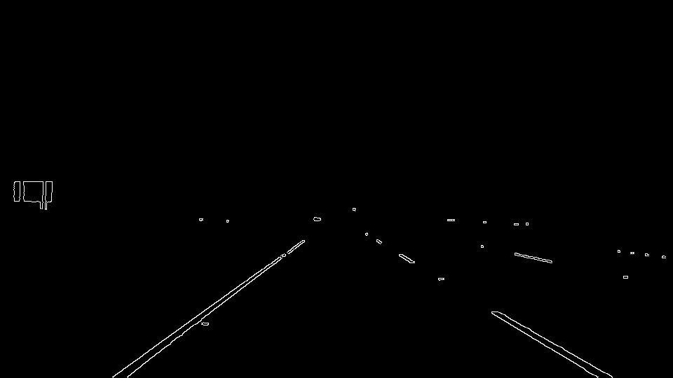
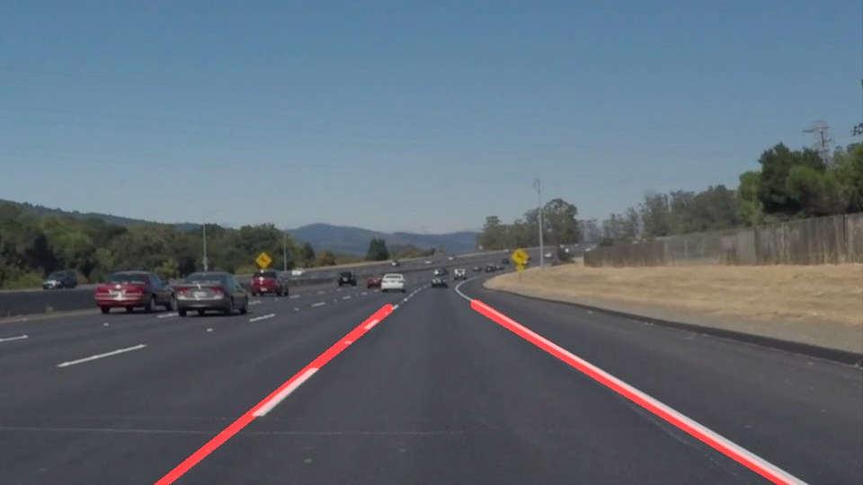

# **Finding Lane Lines on the Road** 
[](http://www.udacity.com/drive)


[](https://www.youtube.com/watch?v=dGyEtI-fLos&list=PLgEbRQF6qHNS0p--lksa_2P5cFgRutAR5 "Link: Lane line detection")


## Overview
When we drive, we use our eyes to decide where to go. The lines on the road that show us where the lanes are act as our constant reference for where to steer the vehicle. Naturally, one of the first things we would like to do in developing a self-driving car is to automatically detect lane lines using an algorithm. This project focuses on finding lane lines using the following algorithms in OpenCV and python:
* Color Selection
* Canny Edge Detection
* Region extraction
* Houghline Trasnform Line extraction
* Image overlay
* Polynomial line - optional

Some of the test images will be demonstrated with each algorithm above applied. The input images are shown below: <p>

    

   
<p align="center">
    *Figure - original test images*
</p>

---
**Color Selection**

The Input image is converted from RGB to HSL(Hue, Saturation, Lightness) spectrum for delicate image processing, closely alignining with the way human vision perceives color-making attributes. White and yellow are two colors of interset for test images, thus white and yellow masks are in place, to extract only white and yellow from the image: *source: (https://phenospex.helpdocs.com/plant-parameters/hue)* </p></p>

<p align="center">
        
</p>

As an alternative approach to RGB color spaces the HSV color space was developed. In this color space the idea is to express the color (hue) on one dedicated channel that is arranged in the rainbow colors. The saturation of each color represents if it is a pale or very intense color. Last, the Value shows if the color is dark or bright. The advantage of this color space is that a color can be expressed independently from its saturation or value. 

The code snippet of *select_white_yellow* and output images after color selection are demonstrated below: </p></p>

```python
def select_white_yellow(image):
    """
    This filters an input image to have HSL (hue, saturation, lightness) spectrum
    and put white/yellow mask for advanced grayscale type filtering,
    which might have some advantage over simple RGB2GRAY convertion method in OpenCV
    """
    # convert RGB to HLS 
    image_hsl = cv2.cvtColor(image, cv2.COLOR_RGB2HLS)
    
    # Color mask : white
    
    low = np.uint8([  0, 200,   0])
    high = np.uint8([255, 255, 255])
    white_mask = cv2.inRange(image_hsl, low, high)
    
    # Color mask : yellow
    low = np.uint8([ 20,   0, 100])
    high = np.uint8([ 30, 255, 255])
    yellow_mask = cv2.inRange(image_hsl, low, high)
    
    # combine the mask
    mask = cv2.bitwise_or(white_mask, yellow_mask)
    return cv2.bitwise_and(image, image, mask = mask)
```

   

   
<p align="center">
    *Figure - output images after color selection*
</p>

---
**Canny Edge Detection**

With the grayscaled/filtered image, Canny edge detection algorithm can be applied to essentially extract edges with white color over black-colored background. This algorithm follows a numerous steps below, but thankfully OpenCV has one liner that inputs low and high threshold for this functionality. In this project, low threshold of 50 and high of 200 are applied after tuning. Steps inside the functionality and the explanations are referenced from *source: (https://docs.opencv.org/trunk/da/d22/tutorial_py_canny.html: </p>
1. Noise Reduction
    Since edge detection is susceptible to noise in the image, first step is to remove the noise in the image with a 5x5 Gaussian filter. In this project, 5x5 Gaussian filter had already been applied as an input before getting to edge detection step.
    
2. Finidng Intensity Gradient of the Image:
    Smoothened image is then filtered with a Sobel kernel in both horizontal and vertical direction to get first derivative in horizontal direction ( Gx) and vertical direction ( Gy). From these two images, we can find edge gradient and direction for each pixel as follows:
<p align="center">
 </p>
</p>

3. Non-maximum Suppression
    After getting gradient magnitude and direction, a full scan of image is done to remove any unwanted pixels which may not constitute the edge. For this, at every pixel, pixel is checked if it is a local maximum in its neighborhood in the direction of gradient. Check the image below:
<p align="center">
     </p>
</p>

4. Hysteresis Thresholding
This stage decides which are all edges are really edges and which are not. For this, we need two threshold values, minVal and maxVal. Any edges with intensity gradient more than maxVal are sure to be edges and those below minVal are sure to be non-edges, so discarded. Those who lie between these two thresholds are classified edges or non-edges based on their connectivity. If they are connected to "sure-edge" pixels, they are considered to be part of edges. Otherwise, they are also discarded.

The code snippet and output images after edge detection processing are shown below: <p>

```python
def canny(img, low_threshold, high_threshold):
    """Applies the Canny transform"""
    return cv2.Canny(img, low_threshold, high_threshold)

```

   

   
<p align="center">
    *Figure - output images after edge detection*
</p>

---
**Region extraction**

Now that edges are highlighted, the images can be regionally cropped/extracted only to focus on the region of interest, which in terms of host lane detection, triangular-like trapezoidal shape is expected. The basic logic to region extraction algorithm is, a mask of same size is created then filled with pixels inside the polygone defined by vertices with the fill color. The four vertices are assigned as following: <p>
    
```python
#imshape[1]: x-camera cooridate, imshape[0]: y-camera cooridate
vertices = np.array([[(imshape[1]*0.1,imshape[0]*0.95),(imshape[1]*0.4, imshape[0]*0.6), (imshape[1]*0.5,imshape[0]*0.6),(imshape[1]*0.9,imshape[0]*0.95)]], dtype=np.int32)
```

 The code snippet and output images after region extraction are shown below: <p>

```python
def region_of_interest(img, vertices):
    """
    Applies an image mask.
    
    Only keeps the region of the image defined by the polygon
    formed from `vertices`. The rest of the image is set to black.
    `vertices` should be a numpy array of integer points.
    """
    #defining a blank mask to start with
    mask = np.zeros_like(img)   

    #defining a 3 channel or 1 channel color to fill the mask with depending on the input image
    if len(img.shape) > 2:
        channel_count = img.shape[2]  # i.e. 3 or 4 depending on your image
        ignore_mask_color = (255,) * channel_count
    else:
        ignore_mask_color = 255
        
    #filling pixels inside the polygon defined by "vertices" with the fill color    
    cv2.fillPoly(mask, vertices, ignore_mask_color)
    
    #returning the image only where mask pixels are nonzero
    masked_image = cv2.bitwise_and(img, mask)
    return masked_image
```

   

   
<p align="center">
    *Figure - output images after region extraction*
</p>

---
**Houghline Trasnform Line extraction**

The cropped image with line edges clearly displayed can be fed into Houghline Transform algorithm for line extraction, which gives 2 pixel points based on various thresholds. The technique of HoughLine Transform is explained via the reference from:
*source: (https://docs.opencv.org/3.4/d9/db0/tutorial_hough_lines.html. The thresholds are set as folliwng after tuning: <p>

```python
# Define the Hough transform parameters
rho = 1 # distance resolution in pixels of the Hough grid
theta = np.pi/180 #angular resolution in radians of the Hough grid
threshold = 10 # minimum number of votes (intersections in Hough grid cell)
min_line_len = 40 #minimum number of pixels making up a line
max_line_gap = 20  # maximum gap in pixels between connectable line segments
```

A line in the image space can be expressed with two variables. For example: <p>
*In the Cartesian coordinate system: Parameters: (m,b).
*In the Polar coordinate system: Parameters: (r,θ)
    
<p align="center">
     
</p>
<p align="center">
    For Hough Transforms, we will express lines in the Polar system. Hence, a line equation can be written as:
</p>
<p align="center">
     
</p>

Arranging the terms: r=xcosθ+ysinθ
If for a given (x0,y0) we plot the family of lines that goes through it, we get a sinusoid. For instance, for x0=8 and y0=6 we get the following plot (in a plane θ - r): <p>

<p align="center">
     </p>
</p>


We consider only points such that r>0 and 0<θ<2π. We can do the same operation above for all the points in an image. If the curves of two different points intersect in the plane θ - r, that means that both points belong to a same line. For instance, following with the example above and drawing the plot for two more points: x1=4, y1=9 and x2=12, y2=3, we get: <p>

<p align="center">
     </p>
</p>

The three plots intersect in one single point (0.925,9.6), these coordinates are the parameters ( θ,r) or the line in which (x0,y0), (x1,y1) and (x2,y2) lay.

What does all the stuff above mean? It means that in general, a line can be detected by finding the number of intersections between curves.The more curves intersecting means that the line represented by that intersection have more points. In general, we can define a threshold of the minimum number of intersections needed to detect a line.

This is what the Hough Line Transform does. It keeps track of the intersection between curves of every point in the image. If the number of intersections is above some threshold, then it declares it as a line with the parameters (θ,rθ) of the intersection point. <p>

 The code snippet and the images with the detected lines drawn are shown below: <p>

```python
def hough_lines(img, rho, theta, threshold, min_line_len, max_line_gap):
    """
    `img` should be the output of a Canny transform.
        
    Returns an image with hough lines drawn.
    """
    lines = cv2.HoughLinesP(img, rho, theta, threshold, np.array([]), minLineLength=min_line_len, maxLineGap=max_line_gap)
    
    line_img = np.zeros((img.shape[0], img.shape[1], 3), dtype=np.uint8)
    draw_lines(line_img, lines)
    return line_img
```

   

   
<p align="center">
    *Figure - output images after line extraction*
</p>

---
**Image overlay**

With the points consisting of all the lines detected by the above algorithms given, the lines can be drawn over the original image. Slopes of the lines can be calculated then assign them as left/right lane for processing based on the sign of the quanitity. slopes of each side on each step of calculation are filtered to only include the ones within the stadard deviations of the mean for curve smoothing. the code snippet of the left slope, intercept filtering is demonstrated below:

```python
#left slope filter:select only the ones within std based on the mean
    new_leftSlope = []
    for ele in left_slope:
        if ele < (np.mean(left_slope) + np.std(left_slope)) and ele > (np.mean(left_slope) - np.std(left_slope)):
            new_leftSlope.append(ele)
            
#left intercept filter:select only the ones within std based on the mean
    new_left_intercept = []
    for ele in left_intercept:
        if ele < (np.mean(left_intercept) + np.std(left_intercept)) and ele > (np.mean(left_intercept) - np.std(left_intercept)):
            new_left_intercept.append(ele)
```
the filtered slope and intercept are be represented as a linear equation of  y = mx + b, and the line can be drawn over the original image with such OpenCV function:
```python
cv2.line(img, (x1_r, y1_r), \
             (x2_r, y2_r), color, thickness)
```

the code snippet of image overlay is shown below:

```python
def draw_lines(img, lines, color=[255, 0, 0], thickness=10):
    """
    NOTE: this is the function you might want to use as a starting point once you want to 
    average/extrapolate the line segments you detect to map out the full
    extent of the lane (going from the result shown in raw-lines-example.mp4
    to that shown in P1_example.mp4).  
    
    Think about things like separating line segments by their 
    slope ((y2-y1)/(x2-x1)) to decide which segments are part of the left
    line vs. the right line.  Then, you can average the position of each of 
    the lines and extrapolate to the top and bottom of the lane.
    
    This function draws `lines` with `color` and `thickness`.    
    Lines are drawn on the image inplace (mutates the image).
    If you want to make the lines semi-transparent, think about combining
    this function with the weighted_img() function below
    """    
    #set empty lists
    left_slope, right_slope =  [], []
    left_intercept,right_intercept = [], []
     
    #for line polynomial (optional challenge)
    leftx1, leftx2, lefty1, lefty2 = [], [], [], []
    rightx1, rightx2, righty1, righty2 = [], [], [], []

    #separate left and right for getting slope/intercept
    for line in lines:
        for x1,y1,x2,y2 in line:
            slope = (y2-y1) / (x2-x1) 
            if slope > 0: #rightSide by Camera coord
                right_slope.append(slope)
                right_intercept.append(((y1 - slope*x1) + (y2 - slope*x2))/2)
                
                #for line polynomial (optional challenge)
                rightx1.append(x1)
                rightx2.append(x2)
                righty1.append(y1)
                righty2.append(y2)
            elif slope < 0: #leftSide by Camera coord
                left_slope.append(slope)
                left_intercept.append(((y1 - slope*x1) + (y2 - slope*x2))/2)
                
                #for line polynomial (optional challenge)
                leftx1.append(x1)
                leftx2.append(x2)
                lefty1.append(y1)
                lefty2.append(y2)
            
    #left : extrapolate
    #extrapolating based on x from 0 ~ 1/2 size width
    imshape = img.shape
    x1_l = 0   #left most edge
    x2_l = int(imshape[1]*0.45) #left neighbor 
    
    #left slope filter:select only the ones within std based on the mean
    new_leftSlope = []
    for ele in left_slope:
        if ele < (np.mean(left_slope) + np.std(left_slope)) and ele > (np.mean(left_slope) - np.std(left_slope)):
            new_leftSlope.append(ele)
            
    #left intercept filter:select only the ones within std based on the mean
    new_left_intercept = []
    for ele in left_intercept:
        if ele < (np.mean(left_intercept) + np.std(left_intercept)) and ele > (np.mean(left_intercept) - np.std(left_intercept)):
            new_left_intercept.append(ele)
    
    m_l = np.mean(new_leftSlope)
    b_l = np.mean(new_left_intercept)
    y1_l, y2_l = 0, 0
   
    #sanity check before getting the exptrapolated output
    if not math.isnan(m_l*x1_l + b_l):
        y1_l = int(m_l*x1_l + b_l)
    else:
        x1_l, x2_l, y1_l,y2_l = 0, 0, 0, 0
    if not math.isnan(m_l*x2_l + b_l):
        y2_l = int(m_l*x2_l + b_l)
    else:
        x1_l, x2_l, y1_l,y2_l = 0, 0, 0, 0

    cv2.line(img, (x1_l, y1_l), \
              (x2_l, y2_l), color, thickness)
            
    #right :extrapolate
    #extrapolating based on x from 1/2 ~ full size width
    x1_r = int(imshape[1]*0.55) #right neighbor 
    x2_r = int(imshape[1]*0.95) #right most edge

    #right slope filter:select only the ones within std based on the mean
    new_rightSlope = []
    for ele in right_slope:
        if ele < (np.mean(right_slope) + np.std(right_slope)) and \
        ele > (np.mean(right_slope) - np.std(right_slope)):
            new_rightSlope.append(ele)

    #right intercept filter:select only the ones within std based on the mean
    new_right_intercept = []
    for ele in right_intercept:
        if ele < (np.mean(right_intercept) + np.std(right_intercept)) and \
        ele > (np.mean(right_intercept) - np.std(right_intercept)):
            new_right_intercept.append(ele)
    
    m_r = np.mean(new_rightSlope)
    b_r = np.mean(new_right_intercept) 
    y1_r, y2_r = 0, 0
    
    #sanity check before getting the exptrapolated output
    if not math.isnan(m_r*x1_r + b_r):
        y1_r = int(m_r*x1_r + b_r)
    else:
        x1_r, x2_r, y1_r, y2_r = 0, 0, 0, 0
    if not math.isnan(m_r*x2_r + b_r):
        y2_r = int(m_r*x2_r + b_r)
    else:
        x1_r, x2_r, y1_r, y2_r = 0, 0, 0, 0

    cv2.line(img, (x1_r, y1_r), \
             (x2_r, y2_r), color, thickness)

    
    ## Polyline Draw : for line polynomial (optional challenge)
    #left
    combx_left = (leftx1 + leftx2)
    comby_left = (lefty1 + lefty2)
    z_l = np.polyfit(combx_left, comby_left, 3)
    
    #right
    combx_right = (rightx1 + rightx2)
    comby_right = (righty1 + righty2)
    z_r = np.polyfit(combx_right, comby_right, 3)
    
    #poly_lines (img,z_l, z_r)
    
    ## end: Polyline Draw

def poly_lines (img, z_l, z_r):
    xp_l = np.linspace(0,img.shape[1]*0.4,10)
    xp_r = np.linspace(img.shape[1]*0.6,img.shape[1]*0.95,10)

    xy_l=np.array([np.array([int(x),int(z_l[3]+z_l[2]*x+ z_l[1]*pow(x,2)+ z_l[0]*pow(x,3))]) for x in xp_l])
    xy_r=np.array([np.array([int(x),int(z_r[3]+z_r[2]*x+ z_r[1]*pow(x,2)+ z_r[0]*pow(x,3))]) for x in xp_r])

    cv2.polylines(img, [ xy_l ], False, (255,255,255),15) 
    cv2.polylines(img, [ xy_r ], False, (255,255,255),15) 
```

   

   

<p align="center">
    *Figure - output images with lane line overlaid*
</p>

---
**Polynomial line - optional**

In additon to straight line detection and its overlay with the orignal images, polynomial line detection is also explored to encounter relatively curvy scenarios. *polyfit* functionality from *numpy* is used to get third order polynimal coefficents to represent a curve with a3*x^3 + a2*x^2 + a1*x + a0, with [a3, a2, a1, a0] being output of *polyfit* by feeding in nfiltered left/right lines points as inputs.

```python
## Polyline Draw : for line polynomial (optional challenge)
#left
combx_left = (leftx1 + leftx2)
comby_left = (lefty1 + lefty2)
z_l = np.polyfit(combx_left, comby_left, 3)

#right
combx_right = (rightx1 + rightx2)
comby_right = (righty1 + righty2)
z_r = np.polyfit(combx_right, comby_right, 3)

#poly_lines (img,z_l, z_r)

def poly_lines (img, z_l, z_r):
    xp_l = np.linspace(0,img.shape[1]*0.4,10)
    xp_r = np.linspace(img.shape[1]*0.6,img.shape[1]*0.95,10)

    xy_l=np.array([np.array([int(x),int(z_l[3]+z_l[2]*x+ z_l[1]*pow(x,2)+ z_l[0]*pow(x,3))]) for x in xp_l])
    xy_r=np.array([np.array([int(x),int(z_r[3]+z_r[2]*x+ z_r[1]*pow(x,2)+ z_r[0]*pow(x,3))]) for x in xp_r])

    cv2.polylines(img, [ xy_l ], False, (255,255,255),15) 
    cv2.polylines(img, [ xy_r ], False, (255,255,255),15) 
```

---
### Conclusion

The biggest challenge was ensuring the parameter tuning is accruate. It is still observed that some cases, the overlaid lane lines on the video are time to time jitter, especially encountering curves even with the polynimal solution. Overall, the lane detection performance is robust with the testing videos. I would like to explore more on improving this on the next project, advanced lane finding.
