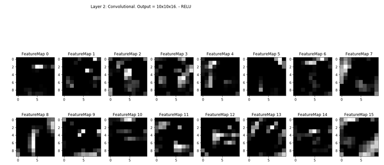

# **Traffic Sign Recognition** 

---

**Build a Traffic Sign Recognition Project**

---
### Overview

This project focuses on exploring techniques and knowledge in deep neural networks and convolutional neural networks to classify traffic signs. Structure of the flow includes training a model, decode traffic signs from natural images by using the German Traffic Sign Dataset, testing the model program on new images of traffic signs found on the web. This project's source code is found in Traffic_Sign_Classifier.ipynb. The trained model from this project showed a satisfying performance with the following result: 
* training set accuracy of 1.000
* validation set accuracy of 0.952 
* test set accuracy of 0.941


As for convolutional neural network structure, LeNet, a convolutional neural network structure proposed by Yann LeCun et al is used as a guideline, while Tensor Flow was used as a primary tool in this project.

<figure style="align: center; text-align:center;">
  
  <div align="center"> <br> 
    *Fig. 1. A 2-stage ConvNet architecture by Yann LeCun (Traffic Sign Recognition with Multi-Scale Convolutional Networks, 2011)* <br/></div>
</figure>

### Data Set Summary & Exploration

#### 1. Provide a basic summary of the data set. In the code, the analysis should be done using python, numpy and/or pandas methods rather than hardcoding results manually.

Number of training examples = 34799

Number of validation examples = 4410

Number of testing examples = 12630

Image data shape = (32, 32, 3)

Number of classes = 43

#### 2. Include an exploratory visualization of the dataset.

<figure style="align: center; text-align:center;">
  
  <div align="center"> <br> 
   *Fig. 2. Histogram of traffic signs distribution* <br/></div>
</figure>

### Design and Test a Model Architecture

#### 1. Describe how you preprocessed the image data. What techniques were chosen and why did you choose these techniques? Consider including images showing the output of each preprocessing technique. Pre-processing refers to techniques such as converting to grayscale, normalization, etc. 

Minimally, the image data should be normalized so that the data has mean zero and equal variance. The image is converted to grayscale, then normalized by mean subtraction and divided by the standard deviation. More pre-processing steps can be used, including YUV color conversion, but rather simpler pre-processing step is used and shown below:

```python
def preProcessing(image):
    grayImg = np.mean(image, axis=3)
    grayImg = np.expand_dims(grayImg, axis=3)
    normImg = (grayImg - grayImg.mean())/grayImg.std()
    return normImg
```

Here is an example of a traffic sign image before and after grayscaling on 5 random samples:

<figure style="align: center; text-align:center;">
  
  <div align="center"> <br> 
   *Fig. 3. five randomly sampled traffic sign image - before pre-processing* <br/></div>
</figure>

<figure style="align: center; text-align:center;">
  
  <div align="center"> <br> 
   *Fig. 4. five randomly sampled traffic sign image - after pre-processing* <br/></div>
</figure>

#### 2. Describe what your final model architecture looks like including model type, layers, layer sizes, connectivity, etc.) Consider including a diagram and/or table describing the final model.

My final model consisted of the following layers:

| Layer         		|     Description	        					| 
|:---------------------:|:---------------------------------------------:| 
| Input         		| 32x32x1 RGB image   							| 
| Convolution 3x3     	| 1x1 stride, same padding, outputs 28x28x6 	|
| RELU					|												|
| Dropout				| keep probability 0.75							|
| Max pooling	      	| 2x2 stride,  outputs 14x14x6 					|
| Convolution 3x3     	| 1x1 stride, same padding, outputs 10x10x16 	|
| RELU					|												|
| Max pooling	      	| 2x2 stride,  outputs 5x5x16 					|
| Flatten				| outputs 120 									|
| Dropout				| keep probability 0.75							|
| Fully connected		| outputs 400 									|
| RELU					|												|
| Fully connected		| outputs 84 									|
| RELU					|												|
| Fully connected		| outputs 43 									|
| Softmax				| cross entropy with logits						|

LeNet training layer function is shown below:

```python
### Run the predictions here and use the model to output the prediction for each image.
### Make sure to pre-process the images with the same pre-processing pipeline used earlier.

from sklearn.utils import shuffle
import tensorflow as tf

EPOCHS = 50
BATCH_SIZE = 128

from tensorflow.contrib.layers import flatten

def LeNet(x):    
    # Arguments used for tf.truncated_normal, randomly defines variables for the weights and biases for each layer
    mu = 0
    sigma = 0.1
    
    # Layer 1: Convolutional. Input = 32x32x1. Output = 28x28x6.
    conv1_W = tf.Variable(tf.truncated_normal(shape=(5, 5, 1, 6), mean = mu, stddev = sigma))
    conv1_b = tf.Variable(tf.zeros(6))
    conv1   = tf.nn.conv2d(x, conv1_W, strides=[1, 1, 1, 1], padding='VALID') + conv1_b

    # Activation.
    conv1 = tf.nn.relu(conv1, name='conv1')

    # Dropout - Regularization
    conv1 = tf.nn.dropout(conv1, keep_prob)
    
    # Pooling. Input = 28x28x6. Output = 14x14x6.
    conv1 = tf.nn.max_pool(conv1, ksize=[1, 2, 2, 1], strides=[1, 2, 2, 1], padding='VALID', name='conv1_maxP')
    
    # Layer 2: Convolutional. Output = 10x10x16.
    conv2_W = tf.Variable(tf.truncated_normal(shape=(5, 5, 6, 16), mean = mu, stddev = sigma))
    conv2_b = tf.Variable(tf.zeros(16))
    conv2   = tf.nn.conv2d(conv1, conv2_W, strides=[1, 1, 1, 1], padding='VALID') + conv2_b
    
    # Activation.
    conv2 = tf.nn.relu(conv2, name='conv2')
    
    # Pooling. Input = 10x10x16. Output = 5x5x16.
    conv2 = tf.nn.max_pool(conv2, ksize=[1, 2, 2, 1], strides=[1, 2, 2, 1], padding='VALID', name='conv2_maxP')

    # Flatten. Input = 5x5x16. Output = 400.
    fc0   = flatten(conv2)
    
    # Dropout - Regularization
    fc0 = tf.nn.dropout(fc0, keep_prob)
    
    # Layer 3: Fully Connected. Input = 400. Output = 120.
    fc1_W = tf.Variable(tf.truncated_normal(shape=(400, 120), mean = mu, stddev = sigma),name='conv2_fullConnect')
    fc1_b = tf.Variable(tf.zeros(120))
    fc1   = tf.matmul(fc0, fc1_W) + fc1_b
    
    # Activation.
    fc1    = tf.nn.relu(fc1)

    # Layer 4: Fully Connected. Input = 120. Output = 84.
    fc2_W  = tf.Variable(tf.truncated_normal(shape=(120, 84), mean = mu, stddev = sigma),name='conv2_fullConnect2')
    fc2_b  = tf.Variable(tf.zeros(84))
    fc2    = tf.matmul(fc1, fc2_W) + fc2_b
    
    # Activation.
    fc2    = tf.nn.relu(fc2)

    # Layer 5: Fully Connected. Input = 84. Output = 43.
    fc3_W  = tf.Variable(tf.truncated_normal(shape=(84, n_classes_train), mean = mu, stddev = sigma),name='conv2_fullConnect3')
    fc3_b  = tf.Variable(tf.zeros(n_classes_train))
    logits = tf.matmul(fc2, fc3_W) + fc3_b
    
    return logits
```

#### 3. Describe how you trained your model. The discussion can include the type of optimizer, the batch size, number of epochs and any hyperparameters such as learning rate.

EPOCHS = 50
BATCH_SIZE = 128

| More Operations 		| Description	        						| 
|:---------------------:|:---------------------------------------------:| 
| Loss_operation		| Adam Optimizer, learning_rate 0.0007			|
| Training operation	| minimize loss operation						|

#### 4. Describe the approach taken for finding a solution and getting the validation set accuracy to be at least 0.93. Include in the discussion the results on the training, validation and test sets and where in the code these were calculated. Your approach may have been an iterative process, in which case, outline the steps you took to get to the final solution and why you chose those steps. Perhaps your solution involved an already well known implementation or architecture. In this case, discuss why you think the architecture is suitable for the current problem.

My final model results were:
* training set accuracy of 1.000
* validation set accuracy of 0.952 
* test set accuracy of 0.941

<figure style="align: center; text-align:center;">
  
  <div align="center"> <br> 
    *Fig. 5. Validation Accuracy* <br/></div>
</figure>

The initial architecture/parameter used differnt from the final architecture/parameter:
* 32x32x3 RGB Image input
* No Dropout regularization
* 2 RELUs, 1 max pooling, and 1 fully connecting operation
* EPOCHS = 10
* Learning rate = 0.0001 

32x32x3 RGB image as an input with simplier pre-processing:

```python
# 3 Channel normalization : higher accuracy
def normalize(image):
    normalized = (image.astype(np.float32) - 128) / 128
    return normalized

# Grayscale normalization - 1 Channel : lower accuray
def preProcess(color_images):
    grayscaled = np.sum(color_images/3, axis=3, keepdims=True)    
    normalized = (grayscaled - 128) / 128 
    return normalized_images
```
Above pre-processing step resulted in low accuracy on both training and validation set, therefore, grayscaling and using actual mean and standard deviation for getting mean zero and equal variance is used as a final pre-processing step to improve under fitting - also increased learning rate and epochs here in the step. Later on, dropout regularization step is added to prevent over fitting, as training accuracy went over 0.99 but validation accurate only around 0.90 - along with 2 RELU, 1 max pooling operations to improve over fitting. Dimensions of filters in Convolutional layer needed to be taken care of carefully, as they dramatically affect the accuracy result without giving obvious sense of being off values, or yield an error sometimes brute force method had to be used for guessing the right input values going in eg) filter size.
 
The network architecture has been benchmarked from *Sermanet, Yann'sTraffic Sign Recognition With Multi-Scale Convolutional Networks'*, which had implemented it using simple two-stage ConvNet and subsamplings then leading to one full connection. The use of CNN is particularly useful here because of the advantage of adaptive filters with large sample data.The batch size is adjusted to 128 so it runs at an adaquate speed within Computer's memory lmit.

### Test a Model on New Images

#### 1. Choose five German traffic signs found on the web and provide them in the report. For each image, discuss what quality or qualities might be difficult to classify.

Here are five German traffic signs found on the web - all as an ideal quality:

<figure style="align: center; text-align:center;">
  
  <div align="center"> <br> 
   *Fig. 6. Five German Traffic Signs to be tested* <br/></div>
</figure>

#### 2. Discuss the model's predictions on these new traffic signs and compare the results to predicting on the test set. At a minimum, discuss what the predictions were, the accuracy on these new predictions, and compare the accuracy to the accuracy on the test set (OPTIONAL: Discuss the results in more detail as described in the "Stand Out Suggestions" part of the rubric).

Here are the results of the prediction:

| Image			 		| Prediction									| 
|:---------------------:|:---------------------------------------------:| 
| Priority road			| Priority road : 12							| 
| Stop					| Stop : 14										|
| No entry				| No entry : 17									|
| Turn right ahead		| Turn right ahead : 33					 		|
| Roundabout mandatory	| Roundabout mandatory :40						|


The model was able to correctly guess 5 of the 5 traffic signs, which gives an accuracy of 100%. This compares favorably to the accuracy on the test set of 0.940

#### 3. Describe how certain the model is when predicting on each of the five new images by looking at the softmax probabilities for each prediction. Provide the top 5 softmax probabilities for each image along with the sign type of each probability

<figure style="align: center; text-align:center;">
  
  <div align="center"> <br> 
   *Fig. 7. Five German Traffic Signs to be tested - softmax probabilities* <br/></div>
</figure>

Softmax operation code snippet is demonstrated below:

```python
### Print out the top five softmax probabilities for the predictions on the German traffic sign images found on the web. 

softmax_logits = tf.nn.softmax(logits)
top_k = tf.nn.top_k(softmax_logits, k=5)

softmaxLogitsList = []
my_top_k_list = []
with tf.Session() as sess:
    sess.run(tf.global_variables_initializer())
    saver.restore(sess, tf.train.latest_checkpoint('.'))
    my_softmax_logits = sess.run(softmax_logits, feed_dict={x: my_images, keep_prob: 1.0})
    my_top_k = sess.run(top_k, feed_dict={x: my_images, keep_prob: 1.0})
    softmaxLogitsList.append(my_softmax_logits)
    my_top_k_list.append(my_top_k)
    print(my_softmax_logits)
    print(my_top_k)
```

### (Optional) Visualizing the Neural Network 

<figure style="align: center; text-align:center;">
  
</figure>

<figure style="align: center; text-align:center;">
  
</figure>

<figure style="align: center; text-align:center;">
  
</figure>

<figure style="align: center; text-align:center;">
  
</figure>

 <div align="center"> <br> 
   *Fig. 8. Visualizing the Neural Network* <br/>
</div>

FeatureMap code snippet is shown below:

```python
### Visualize the network's feature maps here.

# image_input: the test image being fed into the network to produce the feature maps
# tf_activation: should be a tf variable name used during the training procedure that represents the calculated state of a specific weight layer
# activation_min/max: can be used to view the activation contrast in more detail, by default matplot sets min and max to the actual min and max values of the output
# plt_num: used to plot out multiple different weight feature map sets on the same block, just extend the plt number for each new feature map entry

def pltNum_save(argument):
    switcher = {
        1: "Layer1",
        2: "Pooling1",
        3: "Layer2",
        4: "Pooling2",
    }
    return switcher.get(argument, "nothing")

def pltNum_title(argument):
    switcher = {
        1: "Layer 1: Convolutional. Input = 32x32x1. Output = 28x28x6 - RELU",
        2: "Pooling1: Input = 28x28x6. Output = 14x14x6",
        3: "Layer 2: Convolutional. Output = 10x10x16. - RELU",
        4: "Pooling2: Input = 10x10x16. Output = 5x5x16",
    }
    return switcher.get(argument, "nothing")

def outputFeatureMap(image_input, tf_activation, activation_min=-1, activation_max=-1 ,plt_num=1):
    # Here make sure to preprocess the image_input in a way the network expects
    # with size, normalization, ect if needed
    # image_input =
    # Note: x should be the same name as the network's tensorflow data placeholder variable
    # If getting an error tf_activation is not defined it may be having trouble accessing the variable from inside a function
    activation = tf_activation.eval(session=sess,feed_dict={x : my_images, keep_prob : 1.0})
    featuremaps = activation.shape[3]
    plt.figure(plt_num, figsize=(20,20))
    for featuremap in range(featuremaps):
        plt.subplot(6,8, featuremap+1) # sets the number of feature maps to show on each row and column
        plt.title('FeatureMap ' + str(featuremap)) # displays the feature map number
        if activation_min != -1 & activation_max != -1:
            plt.imshow(activation[0,:,:, featuremap], interpolation="nearest", vmin =activation_min, vmax=activation_max, cmap="gray")
        elif activation_max != -1:
            plt.imshow(activation[0,:,:, featuremap], interpolation="nearest", vmax=activation_max, cmap="gray")
        elif activation_min !=-1:
            plt.imshow(activation[0,:,:, featuremap], interpolation="nearest", vmin=activation_min, cmap="gray")
        else:
            plt.imshow(activation[0,:,:, featuremap], interpolation="nearest", cmap="gray")
    # plt.suptitle(pltNum_title(plt_num), horizontalalignment='right', verticalalignment='top', fontsize = 'large')
    # plt.savefig('examples/FeatureMap' + pltNum_save(plt_num) + '.png')
    
with tf.Session() as sess:
    # Layer 1: Convolutional. Input = 32x32x1. Output = 28x28x6 - RELU
    saver.restore(sess, tf.train.latest_checkpoint('.'))
    convo1 = sess.graph.get_tensor_by_name('conv1:0')
    outputFeatureMap(my_images,convo1, activation_min=-1, activation_max=-1, plt_num=1)
    
    # Pooling: Input = 28x28x6. Output = 14x14x6.
    conv1_maxP = sess.graph.get_tensor_by_name('conv1_maxP:0')
    outputFeatureMap(my_images,conv1_maxP, activation_min=-1, activation_max=-1, plt_num=2)

    # Layer 2: Convolutional. Output = 10x10x16. - RELU
    convo2 = sess.graph.get_tensor_by_name('conv2:0')
    outputFeatureMap(my_images,convo2, activation_min=-1, activation_max=-1, plt_num=3)

    # Pooling: Input = 10x10x16. Output = 5x5x16
    conv2_maxP = sess.graph.get_tensor_by_name('conv2_maxP:0')
    outputFeatureMap(my_images,conv2_maxP, activation_min=-1, activation_max=-1, plt_num=4)
```
reference:https://github.com/ajdhole/Udacity-Traffic-Sign-Classifier-Project-2